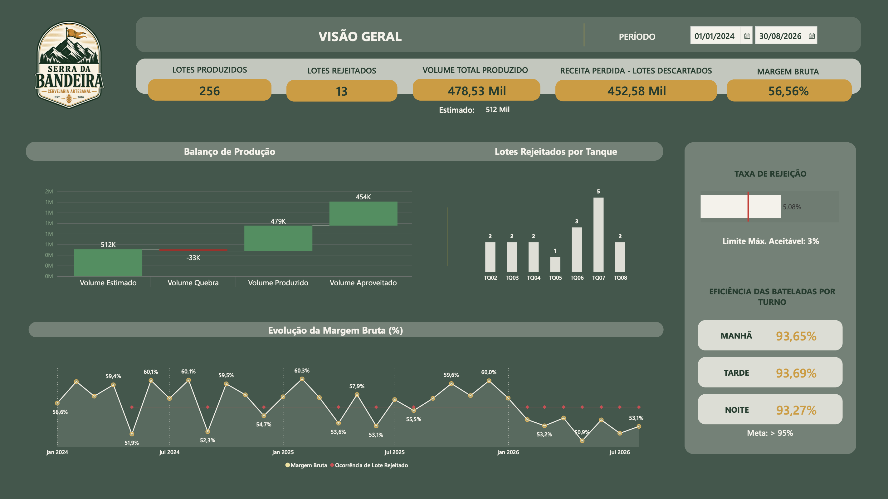
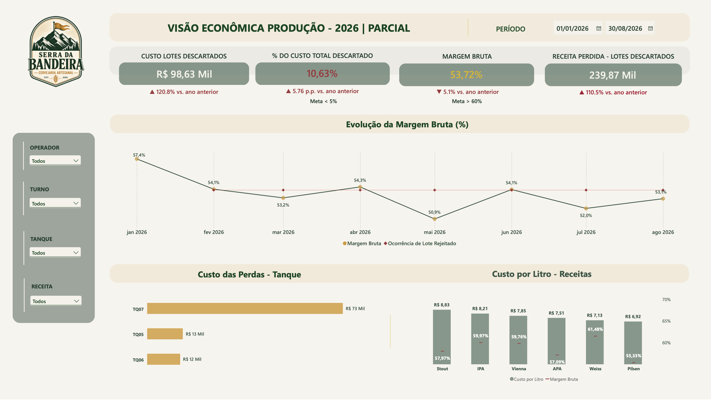
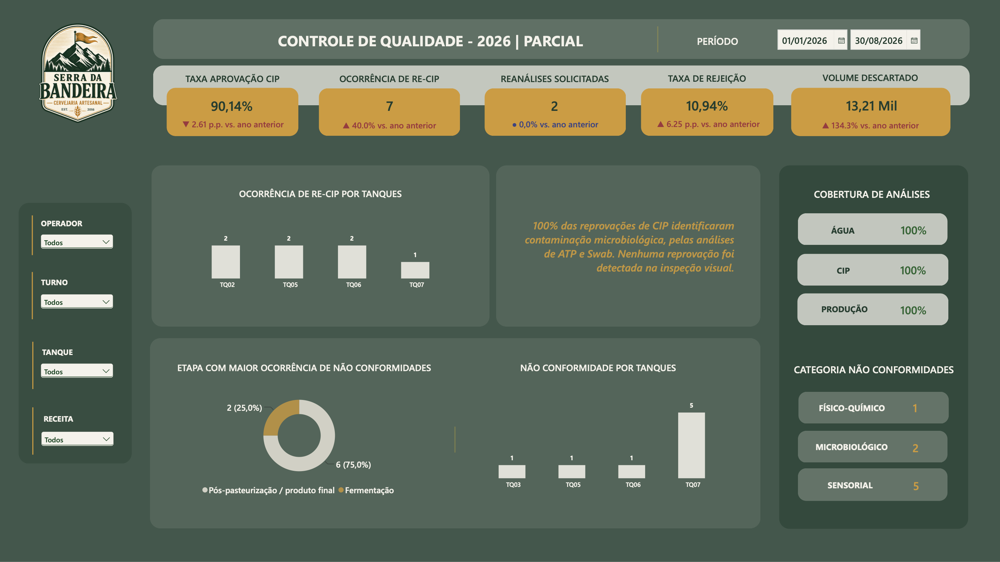
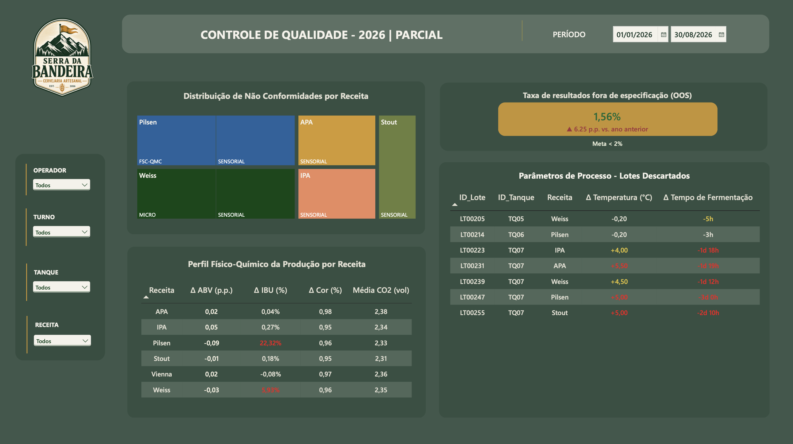
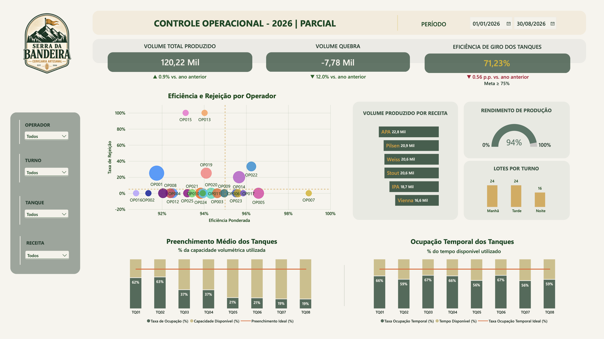
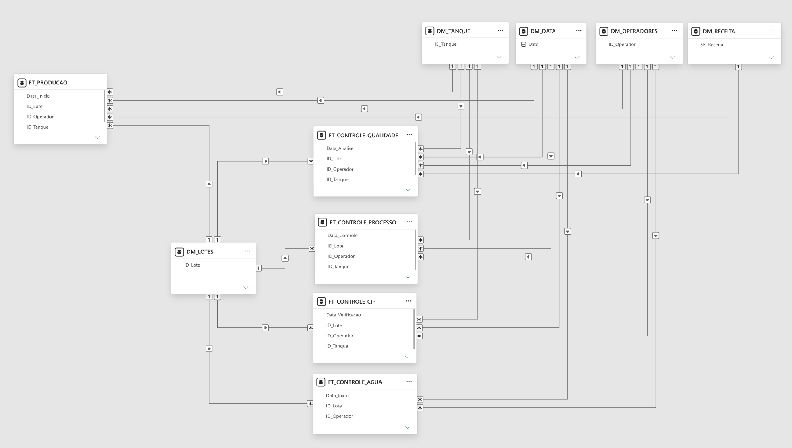

## 🍺 Cervejaria Serra da Bandeira | Análise de Produção e Controle de Qualidade

Projeto de análise de dados desenvolvido em Power BI para uma
cervejaria artesanal fictícia

#### OBJETIVO

Avaliar o desempenho produtivo da cervejaria e identificar
gargalos operacionais, perdas, não conformidades e oportunidades
de melhoria no processo produtivo

#### PERGUNTAS DO NEGÓCIO

1. O processo produtivo está estável ao longo do tempo?
2. Existem tanques com maior índice de não conformidade?
3. Há algum estilo que apresenta maior incidência de desvios? 
4. A qualidade dos produtos finais apresentam tendência de piora?
5. Quais fatores estão associados à rejeição do lote?
6. Quais áreas ou processos devem ser priorizados para melhoria?

#### ENTREGÁVEIS

- Dashboard interativo em Power BI
- Relatório executivo com análise dos indicadores e plano de ação

#### DASHBOARD

  
  
  
  
  

---

#### FERRAMENTAS UTILIZADAS

Power BI /
Power Query /
DAX /
Modelagem dimensional

#### MODELO SEMÂNTICO

- Modelagem dimensional predominantemente em **esquema estrela**, com normalização pontual em **snowflake**
- Separação entre tabelas fato e dimensões, com relacionamentos predominantemente **1:N**
- Uso de dimensões compartilhadas para **Data, Lote, Receita, Tanque e Operador**
- Estrutura projetada para reduzir ambiguidades de filtragem e integrar análises de produção, processo e qualidade.

  

#### ETL 

- Padronização de nomenclatura, correção de formatos de datas e tipos de dados
- Validação e correção de registros duplicados, valores ausentes e outliers

#### MEDIDAS E INDICADORES EM DAX

- KPIs de produção, qualidade, eficiência e financeiro
- Uso de `SUMX()` e `DIVIDE()` em cálculos ponderados, como a eficiência de produção
- Uso de `CALCULATE()` com filtros condicionais para indicadores de rejeição, contaminação e perdas
- Comparações temporais para avaliação de performance com `SAMEPERIODLASTYEAR()`
- Medidas dinâmicas por tanque, operador, receita, turno e período

